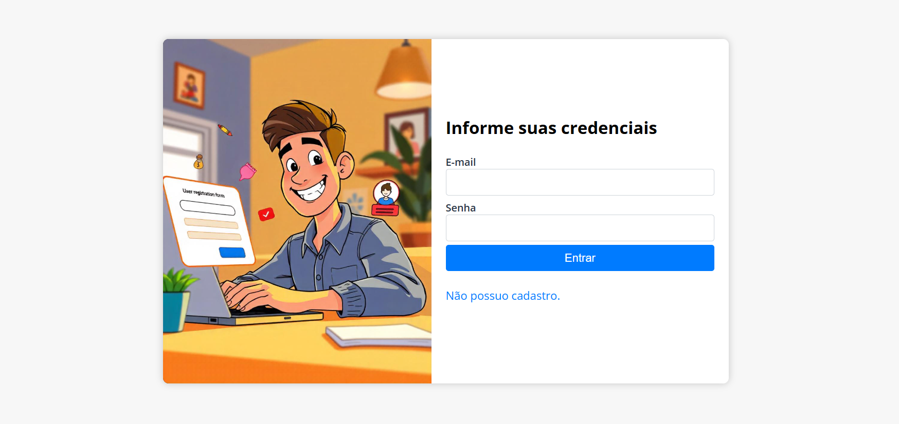
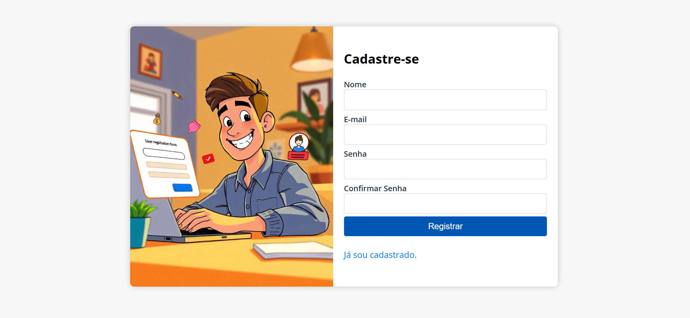
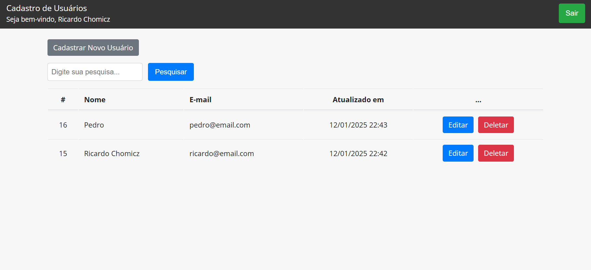
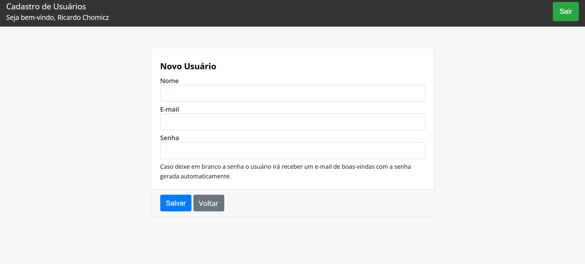
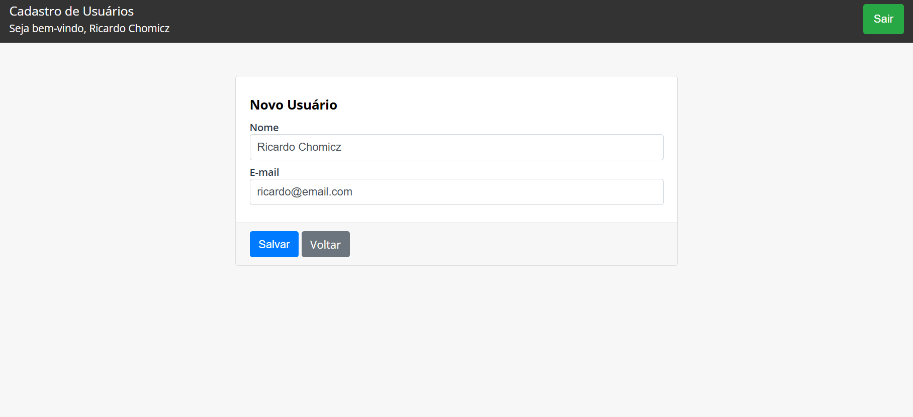
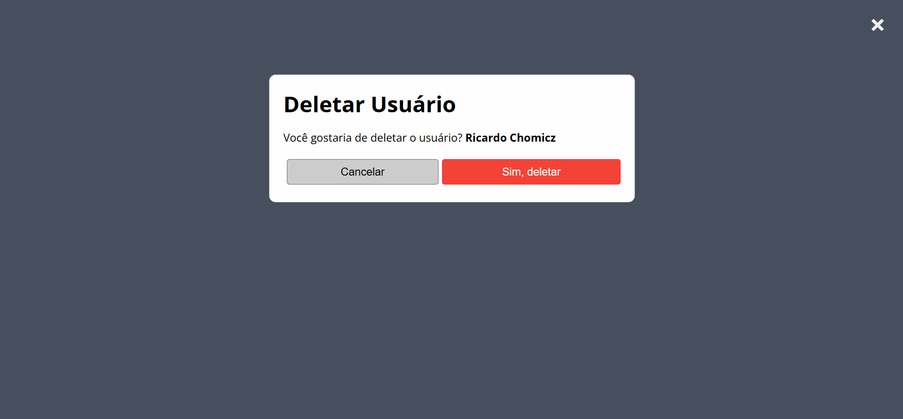

# CadUser

## Sistema de cadastro de usuários

Sistema de cadastro de usuários. 
Tecnologias utilizadas: Laravel, Javascript, CSS.

## Instalação

Clone o repositório:

```bash
git clone https://github.com/ricardochomicz/caduser.git
cd caduser
```

Copie o arquivo [.env.example] para [.env]:

```bash
cp .env.example .env
```

## Utilização Local
- Configure as variáveis de ambiente no arquivo .env

```bash
DB_CONNECTION=mysql
DB_HOST=127.0.0.1
DB_PORT=3306
DB_DATABASE=caduser
DB_USERNAME=root
DB_PASSWORD=root
```

```bash
composer install
```

```bash
php artisan key:generate
```

```bash
php artisan migrate
```
- Executar teste
```bash
php artisan test tests/Unit/UserServiceTest.php
```

- Configurar suas credenciais de e-mail no arquivo .env

<hr>

## Utilização com Docker
- Configure as variáveis de ambiente no arquivo .env

```bash
DB_CONNECTION=mysql
DB_HOST=caduser_db
DB_PORT=3306
DB_DATABASE=caduser
DB_USERNAME=root
DB_PASSWORD=root
```

Storage Logs e Bootstrap Cache:

```bash
mkdir -p storage/logs
mkdir -p bootstrap/cache
```
Set Permissões:

```bash
sudo chown -R www-data:www-data storage
sudo chmod -R 775 storage
sudo chown -R www-data:www-data storage/logs
sudo chmod -R 775 storage/logs
sudo chown -R www-data:www-data bootstrap/cache
sudo chmod -R 775 bootstrap/cache
```
### Iniciar o Container Docker

```bash
docker-compose up -d
```
- Acesse o container

```bash
docker exec -it --user root application bash
```
- Limpe os arquivos de otimização: `container`

```bash
php artisan optmize:clear
```
- Gere a chave da aplicação: `container`

```bash
php artisan key:generate
```
- Execute as migrações do banco de dados: `container`

```bash
php artisan migrate
```

- Executar os testes unitários: `container`

```bash
php artisan test
```

<hr>

## Endpoints

1. Usuários

`GET /users`
* Descrição: Retorna uma lista de usuários cadastrados no sistema.
* Parâmetros de consulta: 
    * search: Filtra pelo nome do usuário.

`POST /users`
* Descrição: Cria um novo usuário no sistema.
* Parâmetros: 
    * name: (obrigatório) Nome do usuário.
    * email: (obrigatório) E-mail do usuário.
    * password: (opcional) Senha do usuário (se não fornecida, uma senha aleatória será gerada).

`PUT /users/{id}`
* Descrição: Atualiza os dados no usuário (name e e-mail).    
* Parâmetros de rota:
    * id: (obrigatório) ID do usuário.

`DELETE /users/{id}`
* Descrição: Apaga o usuário do sistema.
* Parâmetros de rota:
    * id: (obrigatório) ID do usuário.

`REGISTER /register`
* Descrição: Registrar um novo usuário no sistema.
* Parâmetros: 
    * name: (obrigatório) Nome do usuário.
    * email: (obrigatório) E-mail do usuário.
    * password: (obrigatório) Senha do usuário.

<hr>

- Quando o usuário se registra no sistema o campo manager_id recebe o valor null. Quando um usuário é cadastrado dentro do sistema ele recebe o manager_id do usuário logado. 
- O usuário (manager) consegue visualizar todos os cadastros de usuários que ele gerenciou.
- Um usuário comum pode ver o seu cadastro.

<hr>

## Telas Sistema








<hr>

## Principais Funcionalidades

1. `Gerenciamento de Usuários`
  - Registro de Usuários
  - Autenticação de Usuários: Sistema de login para que os usuários possam acessar sua conta.   
  - Recuperação de Senha: Sistema de recuperação de senha para que os usuários possam recuperar sua senha caso esquecidas.
  - Cadastro de Usuários: Sistema de cadastro de usuários para que os administradores possam criar novos usuários.
  - Perfil do Usuário: Sistema de perfil do usuário para que os usuários possam atualizar seu nome e e-mail.
  - Exclusão de Usuários: Sistema de exclusão de usuários.

2. `Filtragem e Pesquisa`
  - Pesquisa de Usuários: Busca pelo nome do usuário.


